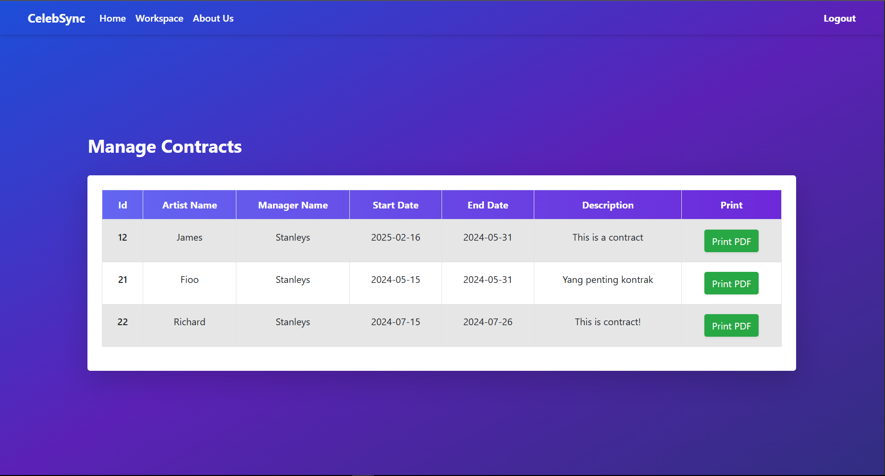

# Artist Management Website

A fully functional web application that manages artist data and schedules, with different roles and access permissions. The website is designed with three distinct user roles: **Admin**, **Manager**, and **Artist**, each having unique access privileges.

## Key Features

- **Role-Based Access Control**: Admin, Manager, and Artist roles with specific permissions.
- **Secure Authentication**: User credentials are encrypted using **Sodium** and hashed with **SHA** and stored in form of token for maximum security.
- **OTP Login**: Login is secured with a one-time password (OTP), which is also encrypted to protect from misuse.
- **Data Management**: Full **CRUD** (Create, Read, Update, Delete) functionality for both artists and managers' data.
- **Interactive Frontend**: Utilizes **jQuery AJAX** for a seamless, dynamic user experience.

## Technologies Used

- **Frontend**: 
  - **Tailwind CSS** for the login page, providing a modern and responsive UI.
  - **Bootstrap** for the main pages, ensuring a clean and structured layout.
  - **jQuery AJAX** to handle frontend interactions and requests dynamically.

- **Backend**: 
  - **PHP** for backend processing and logic.
  - **MySQL** for database management and storage.

- **Security**:
  - **Sodium** for data encryption.
  - **SHA hashing** for secure password management.

## Screenshots

### Login Page (Tailwind CSS)


### Main Dashboard for Admin


### Artist Management Interface for Admin


### Main Dashboard for Manager


### Artist Management Interface for Manager



### Main Dashboard for Member


### Artist Management Interface for Member


## Installation

1. **Clone the Repository**:
    ```bash
    git clone https://github.com/your-username/your-repo-name.git
    ```

2. **Navigate to the Project Directory**:
    ```bash
    cd ARTIST_PROJECT
    ```

3. **Install Dependencies**:
    ```bash
    npm install
    ```

4. **Set Up the Database**:
    Import the provided SQL file into your MySQL database:
    ```bash
    artist_db.sql
    ```

5. **Start Servers**:
    Run the MySQL and Apache servers. You can use **XAMPP** or run PHP’s built-in server:
    ```bash
    php -S localhost:3000
    ```

6. **Activate Sodium Extension**:
    - Ensure the **Sodium** extension is enabled in your `php.ini` file.
    - Add **Sodium** to your VS Code settings by pressing `Ctrl + Shift + P` and accessing your `settings.json`:
    ```json
    {
        "php.stubs": [
            "*",
            "pcntl",
            "sodium",
            "apcu",
            "gd"
        ]
    }
    ```

7. **Access the Application**:
    Open the following URL in your browser, depending on the user type:
    ```
    http://localhost:3000/public/index.php?type=artist
    http://localhost:3000/public/index.php?type=manager
    http://localhost:3000/public/index.php?type=admin
    ```
    
8. **Login Credencials**
   For login information, you can find it in .sql file. In there, change the email for member, manager, and admin with your email in liking (Because you will need your personal email for OTP authentication). The password will always be "yourpassword". You cannot inject this directly because it's encrypted and can be only opened using the key in .sql file.

## Project Purpose

This project is aimed at showcasing the use of **PHP** without relying on any external backend frameworks. It demonstrates robust data security and flexible user management for an artist scheduling system.

## Contributing

Feel free to contribute by creating a pull request. We welcome enhancements and bug fixes!

## License

This project is licensed under the **MIT License**. See the `LICENSE` file for details.
